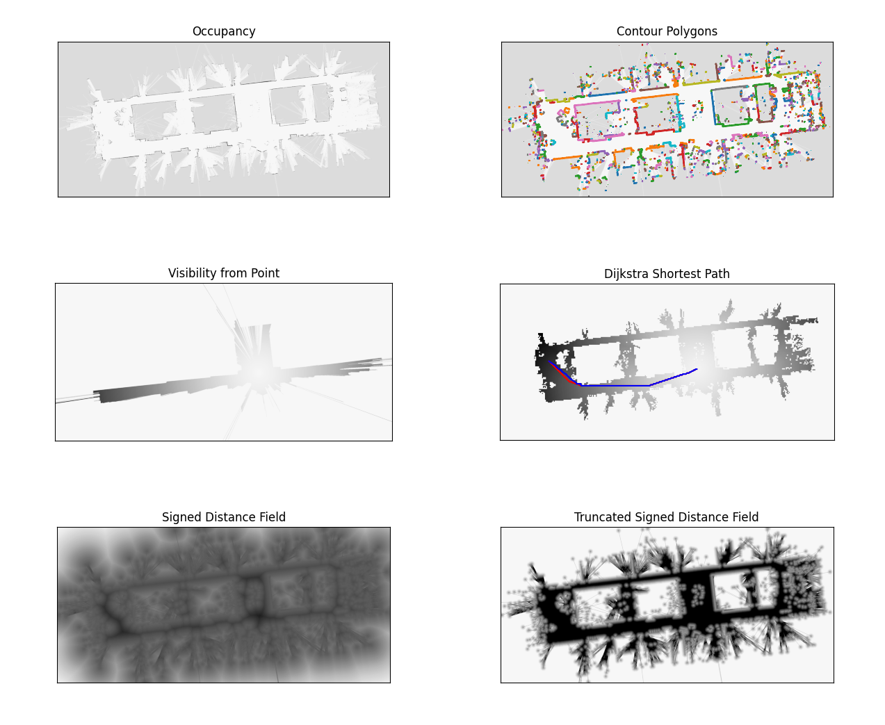
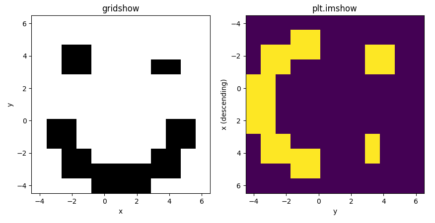

# Add which agent is visibility or not 

e.g. (in CrowdNav[https://github.com/vita-epfl/CrowdNav])

```
        lidar_pos = np.array([robot.px, robot.py, robot.theta], dtype=np.float32)
        ranges = np.ones((self.n_angles,), dtype=np.float32) * self.max_range
        angles = np.linspace(self.scan_min_angle,
                             self.scan_max_angle-self.scan_increment,
                             self.n_angles) + lidar_pos[2]
        other_agents = []
        for i, human in enumerate(humans):
            pos = np.array([human.px, human.py, human.theta], dtype=np.float32)
            dist = distances_travelled_in_base_frame[i].astype(np.float32)
            vel = np.array([human.vx, human.vy], dtype=np.float32)
            if self.lidar_legs:
                agent = CSimAgent(pos, dist, vel, type_="legs", radius = self.leg_radius)
            else:
                agent = CSimAgent(pos, dist, vel, type_="trunk", radius=human.radius)
            other_agents.append(agent)

        self.converter_cmap2d.render_agents_in_lidar(ranges, angles, other_agents, lidar_pos[:2])

        which_visible = [agent.get_agent_which_visible() for agent in other_agents] or which_visible = [agent.visible for agent in other_agent]

```

# Notion 

```get_agent_which_visible``` or ```visible``` must be called after render_agents_in_lidar

# pymap2d

pymap2d is a Cython-based fast toolbox for 2d grid maps.

The CMap2D class provides:
- simple xy <-> ij coordinate conversions
- implementation of the dijkstra / fastmarch algorithm
- fast 2D distance transform (ESDF)
- conversions:
  - to/from polygon vertices
  - from ROS occupancy map or lidar scan message
  - serialization to/from dict



Note: rather than carefully designed, this codebase was chaotically grown. 
It is in dire need of refactoring / documentation. I hope it still proves useful.

## Dependency: Cython
```
$ pip install numpy Cython
```

## Installation:
Inside this project root folder:
```
$ pip3 install -e .
```

## How to

Creating a map

```python
from CMap2D import CMap2D

# empty map
mymap = CMap2D()

# from an array
mymap.from_array(array, origin, resolution)

# from a pgm file
mymap = CMap2D("folder", "filename")

# from a ROS message
mymap.from_msg(msg)
```

Accessing occupancy data, origin, resolution (read-only)

```python
# occupancy as 2d array
mymap.occupancy()

# origin: (x, y) coordinates of point (i, j) = (0, 0)
mymap.origin_xy()

# resolution: size of grid cell [meters]
mymap.resolution()
```

Converting between grid and spatial coordinates

```python
list_of_xy_points = np.array([[1.3, 2.3], [-1.1, -4.0], [6.4, 2.3]])

in_ij_coordinates = mymap.xy_to_floatij(list_of_xy_points)
as_indices = mymap.xy_to_ij(list_of_xy_points, clip_if_outside=True)
```

gridshow is a convenience function, which wraps plt.imshow to intuitively visualize 2d array contents.
It makes the first array dimension x axis and uses grayscale by default.

```python
from CMap2D import gridshow
gridshow(mymap.occupancy())
```




For more examples, see [test](test)/example_*.py
